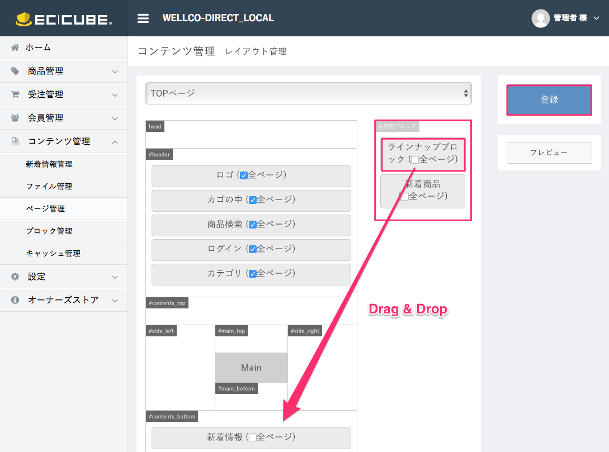

## 【ECCUBE3】ラインナップ プラグイン

ECCUBE3のトップページに新着商品を追加します。　対応ver.3.0.10

### How to install

<font color="red">【注意事項】</font><br />
　・本READMEファイルは、プラグインのインストール及び設置の方法、プラグインのソースを示すもの<br />　　であり、開発中でのプラグイン機能のテストを行う場合は、<a href="">Redmine</a>を参照し、<br />　　その手順に従うこと。
　　
<br />
1. 圧縮ファイル　`LineUpBlock.tar.gz`　の読込み
    EC-CUBE3 管理画面　→　`オーナーズストア`　→　`プラグイン`　→　`ブラグイン一覧`

    独自プラグイン`プラグインのアップロードはこちら`から、`LineUpBlock.tar.gz`　を
    アップロードする。

    

<br /><br />
2. プラグインを有効化する<br />
    `管理画面`　→　`オーナーズストア`　→　`プラグイン`　→　`プラグイン一覧`
    独自プラグイン　`ラインナップ`を`有効`にする。

    

<br /><br />
3. 「ラインナップブロック」ブロックをページへ配置する<br />
    `管理画面`　→　`コンテンツ管理`　→　`ページ管理`　→　`TOPページ`
    右端の`・・・`をクリックして`レイアウト編集`をクリック

    

    未使用ブロックに表示されている「ラインナップブロック」ブロックを配置したい場所にドラッグ<br />＆ドロップする。
    `登録`ボタンを押して保存する。

    

<br /><br />
4. ページにアクセスして、配置した場所に新商品が表示を確認し、問題がなければインストール終了。
<br />

### 備考
  ・表示する商品件数は、以下のファイルを修正することにより変更可能。
  　`lineup.twig`　の8行目

```
  
```

上記の slice(0,<span style="color:red">9</span>)　の「<span style="color:red">9</span>」の部分が表示件数となる。（0は配列の開始位置 -> リストの最初から9個を抜き出す）

・管理画面の商品登録機能により、登録された商品が新着順（id の降順）で表示される。任意の表示順の指定はできない。

・「ラインナップ」プラグインをアンインストールする場合は、プラグインを無効にしてから
　　プラグインを削除する。（関連するファイルも削除される。）

・GitHub 上でのプラグインファイルの管理は下記の通り、`ec-cube` ディレクトリ内に`plugin`ディレクトリを作成し<br />
　　ソースファイル及びインストール用圧縮ファイル`LineUpBlock.tar.gz`を配置する。

```
├── app
├── html
├── plugin
│   └── LineUp_Block
│       ├── Controller
│       │   └── Block
│       │       └── LineUpBlockController.php
│       ├── LICENSE
│       ├── LineUpBlock.tar.gz    //プラグイン インストール用圧縮ファイル
│       ├── LineUpEvent.php
│       ├── PluginManager.php
│       ├── README.md
│       ├── Resource
│       │   └── template
│       │       └── default
│       │           ├── Block
│       │           │   └── lineup_block.twig
│       │           └── lineup.twig
│       ├── ServiceProvider
│       │   └── LineUpBlockServiceProvider.php
│       ├── config.yml
│       ├── event.yml
│       └── img
├── src
```
▲ GitHub上のプラグインソースの配置（インストール後 各ファイルがapp配下に展開される）

***

## プラグイン構成ファイル

### config.yml

app/Plugin/LineUpBlock/config.yml

```
name: ラインナップ                  #プラグイン名
code: LineUpBlock                 #プラグインコード名（プラグイン識別名）
version: 0.0.1                    #プラグインバージョン
event: LineUpEvent                #フックポイントを利用する際に必要。Eventのクラス名を指定。
service:
    - LineUpBlockServiceProvider  #サービスプロバイダー
```

### PluginManager.php

app/Plugin/LineUpBlock/PluginManager.php

```
namespace Plugin\LineUpBlock;

use Eccube\Plugin\AbstractPluginManager;
use Eccube\Common\Constant;
use Eccube\Entity\BlockPosition;
use Eccube\Entity\Master\DeviceType;
use Eccube\Entity\PageLayout;
use Eccube\Util\Cache;
use Symfony\Component\Filesystem\Filesystem;

class PluginManager extends AbstractPluginManager
{
    const BLOCKNAME = "ラインナップブロック";

    const BLOCKFILENAME = "lineup_block";

    private $Block;

    public function __construct()
    {
        $this->Block = sprintf("%s/Resource/template/default/Block/%s.twig", __DIR__, self::BLOCKFILENAME);
    }

    /**
     * プラグインインストール時の処理
     *
     * @param $config
     * @param $app
     * @throws \Exception
     */
    public function install($config, $app)
    {
    }

    /**
     * プラグイン削除時の処理
     *
     * @param $config
     * @param $app
     */
    public function uninstall($config, $app)
    {
        $this->removeBlock($app);
    }

    /**
     * プラグイン有効時の処理
     *
     * @param $config
     * @param $app
     * @throws \Exception
     */
    public function enable($config, $app)
    {
        $this->copyBlock($app);
    }

    /**
     * プラグイン無効時の処理
     *
     * @param $config
     * @param $app
     */
    public function disable($config, $app)
    {
        $this->removeBlock($app);
    }

    public function update($config, $app)
    {
    }

    /**
     * ブロックファイルをブロックディレクトリにコピーしてDBに登録
     *
     * @param $app
     * @throws \Exception
     */
    private function copyBlock($app)
    {
        $this->app = $app;

        $file = new Filesystem();
        $file->copy($this->Block, sprintf("%s/%s.twig", $app['config']['block_realdir'], self::BLOCKFILENAME));

        $this->app['orm.em']->getConnection()->beginTransaction();
        try {
            // ブロックの登録
            $Block = $this->registerBlock();

            // BlockPositionの登録
            $this->registerBlockPosition($Block);

            $this->app['orm.em']->getConnection()->commit();

        } catch (\Exception $e) {
            $this->app['orm.em']->getConnection()->rollback();
            throw $e;
        }
    }

    /**
     * ブロックを削除
     *
     * @param $app
     * @throws \Exception
     */
    private function removeBlock($app)
    {
        // ブロックファイルを削除
        $file = new Filesystem();
        $file->remove(sprintf("%s/%s.twig", $app['config']['block_realdir'], self::BLOCKFILENAME));

        // Blockの取得(file_nameはアプリケーションの仕組み上必ずユニーク)
        /** @var \Eccube\Entity\Block $Block */
        $Block = $app['eccube.repository.block']->findOneBy(array('file_name' => self::BLOCKFILENAME));
        if ($Block)
        {
            $em = $app['orm.em'];
            $em->getConnection()->beginTransaction();
            try {
                // BlockPositionの削除
                $blockPositions = $Block->getBlockPositions();
                /** @var \Eccube\Entity\BlockPosition $BlockPosition */
                foreach ($blockPositions as $BlockPosition)
                {
                    $Block->removeBlockPosition($BlockPosition);
                    $em->remove($BlockPosition);
                }
                // Blockの削除
                $em->remove($Block);
                $em->flush();
                $em->getConnection()->commit();
            } catch (\Exception $e) {
                $em->getConnection()->rollback();
                throw $e;
            }
        }
        Cache::clear($app, false);
    }

    /**
     * ブロックの登録
     *
     * @return \Eccube\Entity\Block
     */
    private function registerBlock()
    {
        $DeviceType = $this->app['eccube.repository.master.device_type']->find(DeviceType::DEVICE_TYPE_PC);
        /** @var \Eccube\Entity\Block $Block */
        $Block = $this->app['eccube.repository.block']->findOrCreate(null, $DeviceType);

        $Block->setName(self::BLOCKNAME);
        $Block->setFileName(self::BLOCKFILENAME);
        $Block->setDeletableFlg(Constant::DISABLED);
        $Block->setLogicFlg(1);
        $this->app['orm.em']->persist($Block);
        $this->app['orm.em']->flush($Block);

        return $Block;
    }

    /**
     * BlockPositionの登録
     *
     * @param $Block
     */
    private function registerBlockPosition($Block)
    {
        $blockPos = $this->app['orm.em']->getRepository('Eccube\Entity\BlockPosition')->findOneBy(
            array('page_id' => 1, 'target_id' => PageLayout::TARGET_ID_UNUSED),
            array('block_row' => 'DESC'));
        $BlockPosition = new BlockPosition();

        // ブロックの順序を変更
        if ($blockPos) {
            $blockRow = $blockPos->getBlockRow() + 1;
            $BlockPosition->setBlockRow($blockRow);
        } else {
            // 1番目にセット
            $BlockPosition->setBlockRow(1);
        }

        $PageLayout = $this->app['eccube.repository.page_layout']->find(1);
        $BlockPosition->setPageLayout($PageLayout);
        $BlockPosition->setPageId($PageLayout->getId());
        $BlockPosition->setTargetId(PageLayout::TARGET_ID_UNUSED);
        $BlockPosition->setBlock($Block);
        $BlockPosition->setBlockId($Block->getId());
        $BlockPosition->setAnywhere(Constant::ENABLED);
        $this->app['orm.em']->persist($BlockPosition);
        $this->app['orm.em']->flush($BlockPosition);
    }

}

```

### event.yml

app/Plugin/LineUpBlock/event.yml

```
eccube.event.render.index.before:
    - [LineUp, NORMAL]
eccube.event.render.homepage.before:
    - [LineUp, NORMAL]
eccube.event.render.top.before:
    - [LineUp, NORMAL]
```

尚、フックポイントの確認は、ターミナルで以下のコマンドを入力し確認できる。

```
$ app/console router:debug
```

### LineUpEvent.php

app/Plugin/LineUpBlock/LineUpEvent.php

```
namespace Plugin\LineUpBlock;
use Symfony\Component\DomCrawler\Crawler;
use Symfony\Component\HttpKernel\Event\FilterResponseEvent;


class LineUpEvent
{
    private $app;

    public function __construct($app)
    {
        $this->app = $app;
    }

    //フロント：トップ画面に商品表示
    Public function LineUp(FilterResponseEvent $event)
    {
        $app = $this->app;
        $LineUpList = $app['orm.em']->getRepository('\Eccube\Entity\Product')
            ->findBy(
                array('Status' => 1,
                      'del_flg' => 0),
                array('id' => 'DESC')
            );
        if (count($LineUpList) > 0) {
            $twig = $app->renderView(
                'LineUpBlock/Resource/template/default/lineup.twig',
                array(
                    'LineUpList' => $LineUpList,
                )
            );
        }

        $response = $event->getResponse();
        $html = $response->getContent();
        //書き換え処理開始
        $crawler = new Crawler($html);
        $oldElement = $crawler
                ->filter('.item_lineUp');
        $oldHtml = $oldElement->html();
        $newHtml = $oldHtml.$twig;
        $html = $crawler->html();
        $html = str_replace($oldHtml, $newHtml, $html);
        //書き換え処理終了

        $response->setContent($html);
        $event->setResponse($response);
    }
}
```

### LineUpBlockController.php

app/Plugin/LineUpBlock/Controller/Block/LineUpBlockController.php

```
<?php

namespace Plugin\LineUpBlock\Controller\Block;

use Eccube\Application;
use Symfony\Component\HttpFoundation\Request;

class LineUpBlockController
{

    /**
     * LineUpBlock画面
     *
     * @param Application $app
     * @param Request $request
     * @return \Symfony\Component\HttpFoundation\Response
     */
    public function index(Application $app, Request $request)
    {
        return $app['view']->render('Block/lineup_block.twig', array(
            // add parameter...
        ));
    }

}
```

### LineUpBlockServiceProvider.php

app/Plugin/LineUpBlock/ServiceProvider/LineUpBlockServiceProvider.php

```
<?php

namespace Plugin\LineUpBlock\ServiceProvider;

use Eccube\Application;
use Monolog\Handler\FingersCrossed\ErrorLevelActivationStrategy;
use Monolog\Handler\FingersCrossedHandler;
use Monolog\Handler\RotatingFileHandler;
use Monolog\Logger;
use Plugin\SampleBlock\Form\Type\LineUpBlockConfigType;
use Silex\Application as BaseApplication;
use Silex\ServiceProviderInterface;
use Symfony\Component\Yaml\Yaml;


class LineUpBlockServiceProvider implements ServiceProviderInterface
{
    public function register(BaseApplication $app)
    {
        // ブロック
        $app->match('/block/lineup_block', '\Plugin\LineUpBlock\Controller\Block\LineUpBlockController::index')
            ->bind('block_lineup_block');

    }

    public function boot(BaseApplication $app)
    {
    }
}
```

### lineup.twig

app/Plugin/LineUpBlock/Resource/template/default/lineup.twig

```
<div id="item_list">
    <div class="row">
      
        <div class="col-sm-4 col-xs-6">
            <div class="pickup_item">
                <a href="{{ url('product_detail', {'id': lineUp.id}) }}">
                    <div class="item_photo"></div>
                    <dd class="item_comment">{{ lineUp.description_list }}</dd>
                </a>
            </div>
      </div>
      
    </div>
  </div>
```

### lineup_block.twig

app/Plugin/LineUpBlock/Resource/template/default/Block/lineup_block.twig

```
<div class="item_lineUp">
    <ul class="row"></ul>
</div>
```

## 「ラインナップ」プラグイン ツリー構成

```

  app
   ├── Plugin
   │   └── LineUpBlock
   │       ├── Controller
   │       │   └── Block
   │       │       └── LineUpBlockController.php    //コントローラー
   │       ├── LICENSE
   │       ├── LineUpEvent.php      //フックポイントや入力フォームの拡張時の業務処理
   │       ├── PluginManager.php    //プラグイン管理ファイル
   │       ├── README.md
   │       ├── Resource
   │       │   └── template
   │       │       └── default
   │       │           ├── Block
   │       │           │   └── lineup_block.twig    //template/default/Blockが優先
   │       │           └── lineup.twig              //一覧表示用twig
   │       ├── ServiceProvider
   │       │   └── LineUpBlockServiceProvider.php   //DIコンテナ定義
   │       ├── config.yml                           //プラグイン全体の設定ファイル
   │       └── event.yml                            //イベント定義ファイル
   └── template
       ├── admin
       └── default
           └── Block
               └── lineup_block.twig    //ブロック差込み用twig

```
▲ プラグイン インストール後のファイル構成

以上
